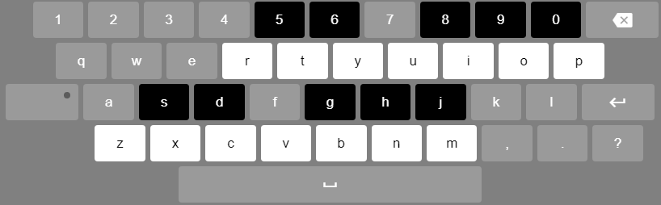

# plain Javascript piano

A single keyboard I made cuz I was boring

### Keys

	 S  D     G  H  J		 5  6     8  9  0
	 c# d#    f# g# a#		 c# d#    f# g# a#
	
	Z  X  C  V  B  N  M		R  T  Y  U  I  O  P
	c  d  e  f  g  a  b		c  d  e  f  g  a  b

  
[try it online](https://luizon.github.io/js_piano/)